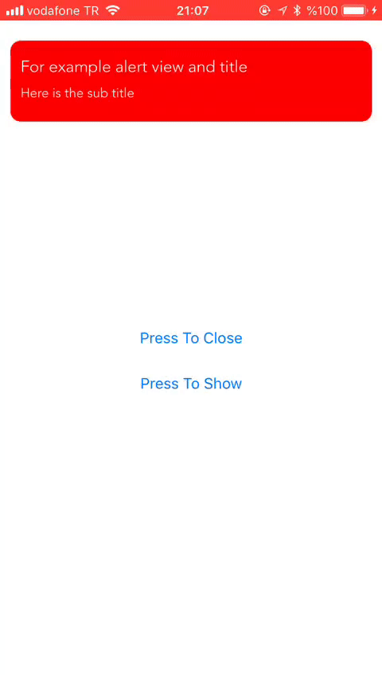

[](https://travis-ci.org/TBXark/PinterestSegment)

# Welcome to MyAlert!

Hi! MyAlert is an alertview. Shortly , show notifications in the app. It is simple to use and easy to develop.




# Requirements

- iOS 9.0+
- Xcode 9.0
- Swift 4

# Installation

   ## CocoaPods
   You can use [CocoaPods](http://cocoapods.org/) to install `myAlert` by adding it to your `Podfile`:

   ```ruby
    platform :ios, '9.0'
    use_frameworks!
    pod 'myAlert'
   ```

  ## Manually
  1. Download and drop ```MyAlertController.swift``` in your project.  
  2. Congratulations!  

# Usage 

```sh
    let myAlert = MyAlertController()
     myAlert.yourView = self.view
     myAlert.bgColor = UIColor.red
     myAlert.textColor = UIColor.white
     myAlert.show(title:"For example alert view and title",subtitle:"Here is the sub title",delay:3)
```


## Release History

* 1.0.0
  first commit
